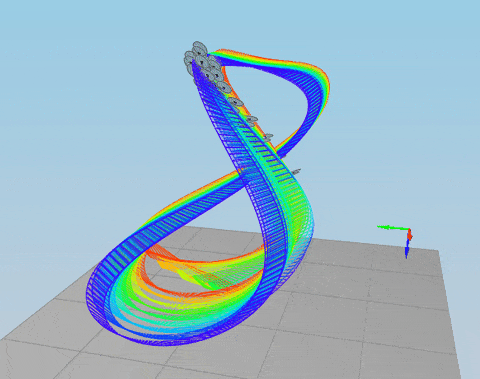
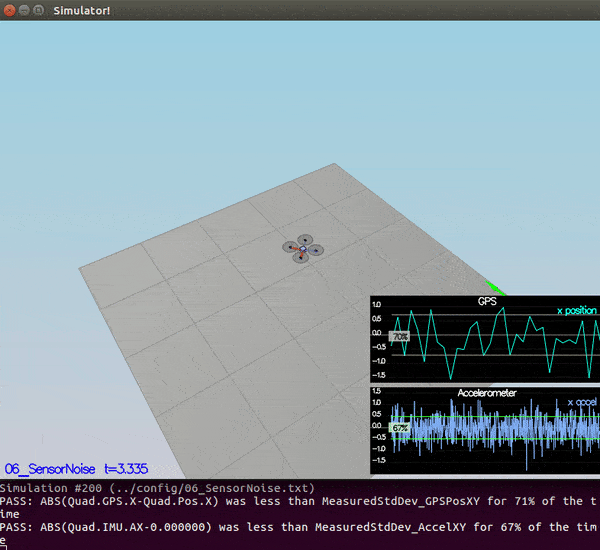
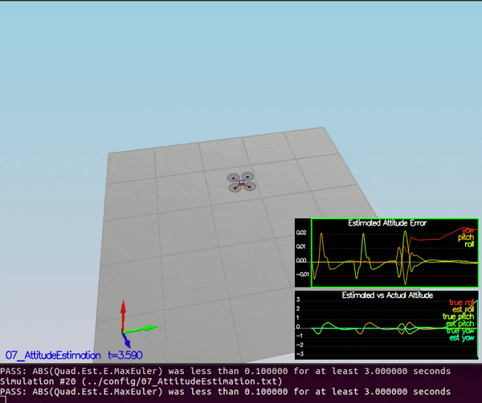
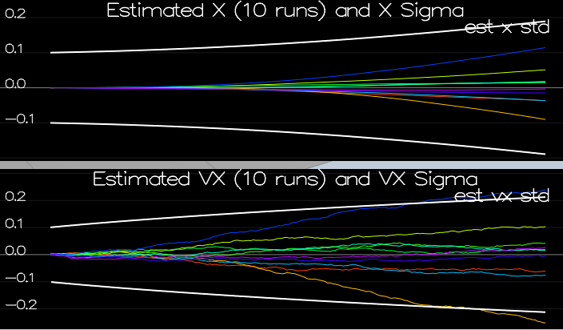
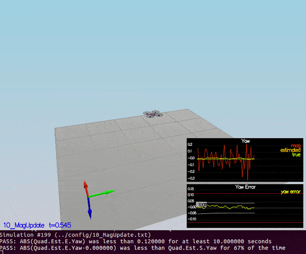
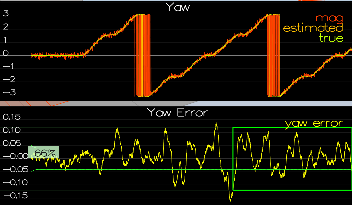
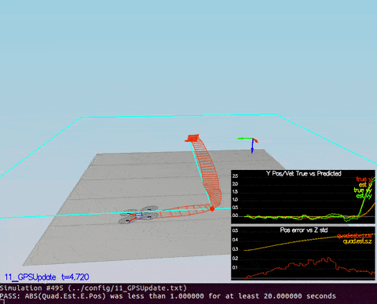
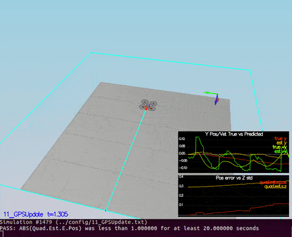

# Project: Estimation



## Project description

The main task in this project is to implement an estimator for quadrotors to deal with realistic and noisy sensors
using [Extended Kalman Filter(EKF)](https://en.wikipedia.org/wiki/Extended_Kalman_filter) and fusing gyro, IMU, gps, and magnetometer signals to get
an estimate of position, velocity, and yaw angle.

## Required Steps for a Passing Submission:

1. Make sure you have cloned the repository and gotten familiar with the additional project repository files Introduction.
2. Implement all the necessary update and prediction steps required for your estimator to meet all the performance criteria of each step, outlined in detail in the project [README](https://github.com/udacity/FCND-Estimation-CPP/blob/master/README.md)
3. Tune your estimator, and re-tune your controller from your controls C++ project to successfully fly the desired trajectory with realistic sensors

## File description
- [QuadEstimatorEKF.txt](./config/QuadEstimatorEKF.txt): This files contains the estimator parameters.
- [QuadEstimatorEKF.cpp](./src/QuadEstimatorEKF.cpp): This file contains the estimator implementation. The original file with placeholders for the EKF implementaion was provided by Udacity. 
- [QuadControlParams.txt](./config/QuadControlParams.txt): This file contains the configuration for the controller. The parameters are re-tuned to work successfully with the estimator.
- [QuadControl.cpp](./src/QuadControl.cpp): This file contains the implementation of the controller by Udacity. 
- [Graph1.txt](./config/log/Graph1.txt): This is a log file containing `Quad.GPS.X` measurements.
- [Graph2.txt](./config/log/Graph2.txt): This is a log file containing `Quad.IMU.AX` measurements.

## Tasks results

#### Step 1: Sensor Noise



#### Step 2: Attitude Estimation



#### Step 3: Prediction Step



#### Step 4: Magnetometer Update





#### Step 5: Closed Loop + GPS Update



#### Step 6: Adding Your Controller



## [Rubric Points](https://review.udacity.com/#!/rubrics/1807/view)

## Writeup
### Provide a Writeup / README that includes all the rubric points and how you addressed each one. You can submit your writeup as markdown or pdf.

The writeup is provided in README.md as you are reading it.

## Implement Estimator

### Determine the standard deviation of the measurement noise of both GPS X data and Accelerometer X data.

| Measurement | Quad.GPS.X |
| :--- | :--- |
| Sample Standard Deviation (s) | **0.71611221969575** |
| Variance-Sample Standard (s2)| 0.51281671119757 |
| Population Standard Deviation (σ) | 0.71216666779826 |
| Variance-Population Standard (σ2) | 0.50718136272287 |
| Total Numbers (N) | 91 |
| Sum | -2.540099 |
| Mean (Average) | -0.027913175824176 |
| Standard Error of the Mean (SEx̄) | 0.075068958129833 |

| Measurement | Quad.IMU.AX |
| :--- | :--- |
| Sample Standard Deviation (s) | **0.48245032602929** |
| Variance-Sample Standard (s2)| 0.23275831708577 |
| Population Standard Deviation (σ) | 0.48196763423657 |
| Variance-Population Standard (σ2) | 0.2322928004516 |
| Total Numbers (N) | 500 |
| Sum | -3.991359 |
| Mean (Average) | -0.007982718 |
| Standard Error of the Mean (SEx̄) | 0.021575834495369 |

### Implement a better rate gyro attitude integration scheme in the `UpdateFromIMU()` function.

This part is implemented in [QuadEstimatorEKF::UpdateFromIMU](./src/QuadEstimatorEKF.cpp#L109-L132):

```cpp
////////////////////////////////////////////
/// Rotation matrix-based implementation ///
////////////////////////////////////////////
// create a rotation matrix using attitude estimate (roll and pitch)
Mat3x3F rotationMat = Mat3x3F();
rotationMat(0,0) = 1.0;
rotationMat(0,1) = sin(rollEst) * tan(pitchEst);
rotationMat(0,2) = cos(rollEst) * tan(pitchEst);
rotationMat(1,1) = cos(rollEst);
rotationMat(1,2) = -sin(rollEst);
rotationMat(2,1) = sin(rollEst) / cos(pitchEst);
rotationMat(2,2) = cos(rollEst) / cos(pitchEst);

// compute body rates (turn rates) estimation
V3F bodyRate = rotationMat * gyro;

// integrate body rates
float predictedRoll = rollEst + dtIMU * bodyRate.x;
float predictedPitch = pitchEst + dtIMU * bodyRate.y;
ekfState(6) = ekfState(6) + dtIMU * bodyRate.z;

// normalize yaw to -pi .. pi
if (ekfState(6) > F_PI) ekfState(6) -= 2.f*F_PI;
if (ekfState(6) < -F_PI) ekfState(6) += 2.f*F_PI;
```

### Implement all of the elements of the prediction step for the estimator.

This part is implemented in [QuadEstimatorEKF::PredictState](./src/QuadEstimatorEKF.cpp#L194-L205), 
[QuadEstimatorEKF::GetRbgPrime](./src/QuadEstimatorEKF.cpp#L231-L238), 
and [QuadEstimatorEKF::Predict](./src/QuadEstimatorEKF.cpp#L283-L298):

- [QuadEstimatorEKF::PredictState](./src/QuadEstimatorEKF.cpp#L194-L205):

```cpp
// Update predicted x,y,z using simple linear integration
predictedState(0) = curState(0) + dt * curState(3);
predictedState(1) = curState(1) + dt * curState(4);
predictedState(2) = curState(2) + dt * curState(5);

// rotate accel from bodyframe to inertial fram
accel = attitude.Rotate_BtoI(accel); // Let's reuse accel

// update predicted vx,vy,vz
predictedState(3) = curState(3) + dt * accel.x;
predictedState(4) = curState(4) + dt * accel.y;
predictedState(5) = curState(5) + dt * (accel.z - CONST_GRAVITY);
```

- [QuadEstimatorEKF::GetRbgPrime](./src/QuadEstimatorEKF.cpp#L231-L238):

```cpp
// 1st row
RbgPrime(0,0) = - cos(pitch) * sin(yaw);
RbgPrime(0,1) = - sin(roll)  * sin(pitch) * sin(yaw) - cos(pitch) * cos(yaw);
RbgPrime(0,2) = - cos(roll)  * sin(pitch) * sin(yaw) + sin(roll)   * cos(yaw);
// 2nd row
RbgPrime(1,0) = cos(pitch) * cos(yaw);
RbgPrime(1,1) = sin(roll)  * sin(pitch) * cos(yaw) - cos(roll) * sin(yaw);
RbgPrime(1,2) = cos(roll) * sin(pitch) * cos(yaw) + sin(roll) * sin(yaw);
```

- [QuadEstimatorEKF::Predict](./src/QuadEstimatorEKF.cpp#L283-L298):

```cpp
// create helper matrices
V3F rPBG[3];
for(int i=0; i<3; i++){
rPBG[i] = V3F(RbgPrime(i,0), RbgPrime(i,1), RbgPrime(i,2));
}

// fill up gPrime matrix
gPrime(0,3) = dt;
gPrime(1,4) = dt;
gPrime(2,5) = dt;
gPrime(3, 6) = (rPBG[0] * accel).sum() * dt;
gPrime(4, 6) = (rPBG[1] * accel).sum() * dt;
gPrime(5, 6) = (rPBG[2] * accel).sum() * dt;

// update cov
ekfCov = gPrime * ekfCov * gPrime.transpose() + Q;
```
### Implement the magnetometer update.

This part is implemented in [QuadEstimatorEKF::UpdateFromMag](./src/QuadEstimatorEKF.cpp#L350-L361):

```cpp
  zFromX(0) = ekfState(6);
  float diff = magYaw - zFromX(0);

  // normalize diff to -pi .. pi
  if (diff > F_PI) diff -= 2.f*F_PI;
  if (diff < -F_PI) diff += 2.f*F_PI;

  // update zFromX based on normalized diff
  zFromX(0) = magYaw - diff;

  // hPrime = [0,0,0,0,0,1]
  hPrime(0, 6) = 1;
```

### Implement the GPS update.

This part is implemented in [QuadEstimatorEKF::UpdateFromGPS](./src/QuadEstimatorEKF.cpp#L322-L329):

```cpp
for (int i=0; i<6;i++){
  zFromX(i) = ekfState(i);
}

// hPrime = eye(6)
for (int i = 0; i < 6; i++){
hPrime(i,i) = 1.f;
}
```

## Flight Evaluation
### Meet the performance criteria of each step.

All the performance criteria are met:

```bash
# Step 1
PASS: ABS(Quad.GPS.X-Quad.Pos.X) was less than MeasuredStdDev_GPSPosXY for 67% of the time
PASS: ABS(Quad.IMU.AX-0.000000) was less than MeasuredStdDev_AccelXY for 69% of the time

# Step 2
PASS: ABS(Quad.Est.E.MaxEuler) was less than 0.100000 for at least 3.000000 seconds

# Step 4
PASS: ABS(Quad.Est.E.Yaw) was less than 0.120000 for at least 10.000000 seconds
PASS: ABS(Quad.Est.E.Yaw-0.000000) was less than Quad.Est.S.Yaw for 67% of the time

# Step 5
PASS: ABS(Quad.Est.E.Pos) was less than 1.000000 for at least 20.000000 seconds

# Step 6
PASS: ABS(Quad.Est.E.Pos) was less than 1.000000 for at least 20.000000 seconds
```

### De-tune your controller to successfully fly the final desired box trajectory with your estimator and realistic sensors.

The drone successfully track the trajectory as displayed above.

