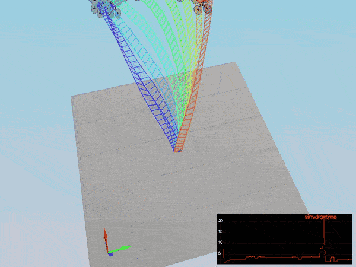
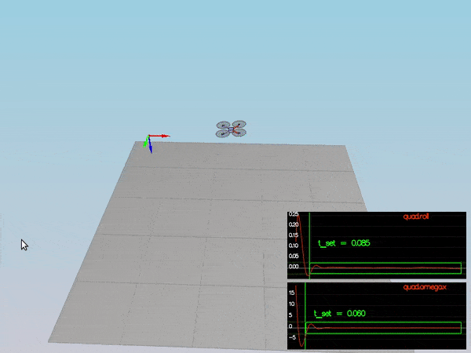
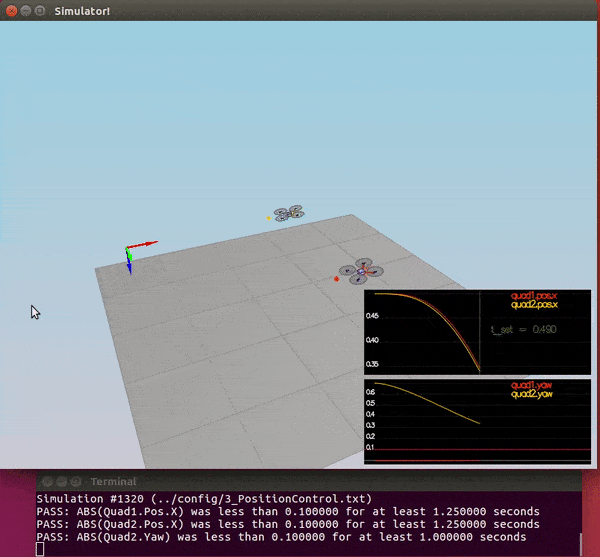
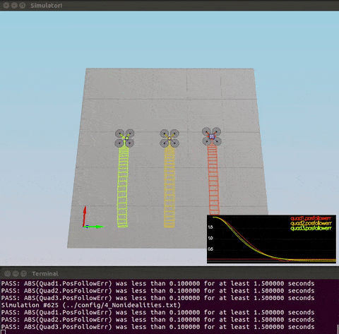
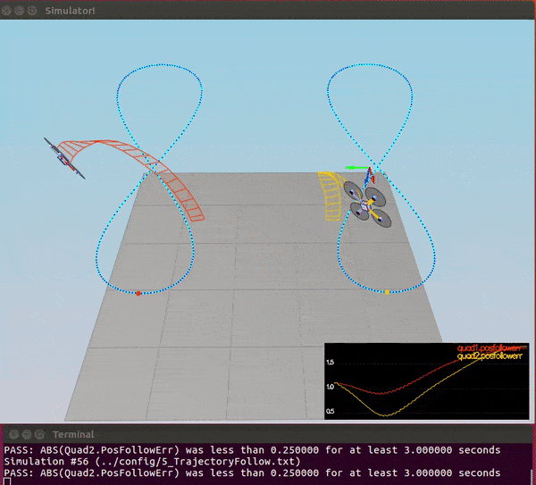

# Project: Quadrotor 3D Controller


## Project description

Implementing a cascade controller for quadrotors in C++ to control body rate/pitch/yaw, altitude, and lateral position.


## Required Steps for a Passing Submission:
1. Setup the [Udacity C++ simulator repository](https://github.com/udacity/FCND-Controls-CPP)
2. Complie and test the simulator
3. Adjust the `Mass` parameter in `QuadControlParams.txt` to make the vehicle stay in the same altitude.
4. Implement body rate control and tune `kpPQR` parameter in `QuadControlParams.txt` to get the vehicle to stop spinning quickly with no overshoot.
5. Implement roll/pitch control and tune `kpBank` in `QuadControlParams.txt` to minimize settling time with minimal overshoot.
6. Implement lateral position control and altitude control and tune `kpPosZ`, `kpPosZ`, `kpVelXY`, `kpVelZ` to get the vehicles to approximately reach to their destination points with some errors.
7. Implement yaw control and tune `kpYaw` and the 3rd component of `kpPQR` to minimize settling time.
8. Tweak the controller parameters to achieve robustness agains some of the non-idealities of a controller.
9. Retune the controller parameters to get vehicle to track a trajectory.

## File description

- [QuadControlParams.txt](./cpp/config/QuadControlParams.txt): This file contains the configuration for the controller. The simulator checks config files during run-time and applies new parameters on the next loop execution upon changes.
- [QuadControl.cpp](./cpp/src/QuadControl.cpp): This file contains the implementation of the controller. The original file with placeholders for the controllers was provided by Udacity [here](https://github.com/udacity/FCND-Controls-CPP/blob/master/src/QuadControl.cpp). 

## Scenario description

#### Scenario 1: Intro

This is an introductory scenario to test the simulator and adjust the `Mass` parameters in [QuadControlParams.txt](./cpp/config/QuadControlParams.txt) to make the vehicle stay in the same altitude.


#### Scenario 2: Body rate and roll/pitch control

In this scenario, there is a quadrotor initiated with a small initial rotation speed about its roll axis. The main task is to implement body rate abd roll/pitch controllers to stabilize the rotational motion.



#### Scenario 3: Position/velocity and yaw angle control




#### Scenario 4: Non-idealities and robustness



#### Scenario 5: Tracking trajectories



## [Rubric Points](https://review.udacity.com/#!/rubrics/1643/view)

## Writeup
### Provide a Writeup / README that includes all the rubric points and how you addressed each one. You can submit your write-up as markdown or pdf.

You're reading it! Below I describe how I addressed each rubric point and where in my code each point is handled.

## Implemented Controller

### Implemented body rate control in C++.

### Implement roll pitch control in C++.


### Implement altitude controller in C++.


### Implement lateral position control in C++.


### Implement yaw control in C++.


### Implement calculating the motor commands given commanded thrust and moments in C++.


## Flight Evaluation

### Your C++ controller is successfully able to fly the provided test trajectory and visually passes inspection of the scenarios leading up to the test trajectory.

The implementation pass scenarios 1 to 5:

```
# Scenario 1
PASS: ABS(Quad.PosFollowErr) was less than 0.500000 for at least 0.800000 seconds
# Scenario 2
PASS: ABS(Quad.Roll) was less than 0.025000 for at least 0.750000 seconds
PASS: ABS(Quad.Omega.X) was less than 2.500000 for at least 0.750000 seconds
# Scenario 3
PASS: ABS(Quad1.Pos.X) was less than 0.100000 for at least 1.250000 seconds
PASS: ABS(Quad2.Pos.X) was less than 0.100000 for at least 1.250000 seconds
PASS: ABS(Quad2.Yaw) was less than 0.100000 for at least 1.000000 seconds
# Scenario 4
PASS: ABS(Quad1.PosFollowErr) was less than 0.100000 for at least 1.500000 seconds
PASS: ABS(Quad2.PosFollowErr) was less than 0.100000 for at least 1.500000 seconds
PASS: ABS(Quad3.PosFollowErr) was less than 0.100000 for at least 1.500000 seconds
# Scenario 5
PASS: ABS(Quad2.PosFollowErr) was less than 0.250000 for at least 3.000000 seconds
```
