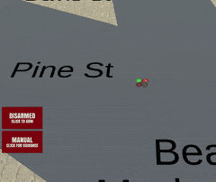
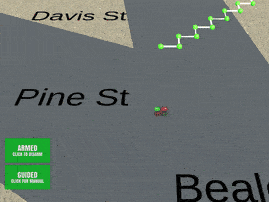

## Project: 3D Motion Planning


# Required Steps for a Passing Submission:
1. Load the 2.5D map in the colliders.csv file describing the environment.
2. Discretize the environment into a grid or graph representation.
3. Define the start and goal locations.
4. Perform a search using A* or other search algorithm.
5. Use a collinearity test or ray tracing method (like Bresenham) to remove unnecessary waypoints.
6. Return waypoints in local ECEF coordinates (format for `self.all_waypoints` is [N, E, altitude, heading], where the drone’s start location corresponds to [0, 0, 0, 0].
7. Write it up.
8. Congratulations!  Your Done!

## [Rubric](https://review.udacity.com/#!/rubrics/1534/view) Points
### Here I will consider the rubric points individually and describe how I addressed each point in my implementation.

### README

#### 1. Provide a Writeup / README that includes all the rubric points and how you addressed each one. You can submit your writeup as markdown or pdf.

You're reading it! Below I describe how I addressed each rubric point and where in my code each point is handled.

### Explain the Starter Code

#### 1. Explain the functionality of what's provided in `motion_planning.py` and `planning_utils.py`
These scripts contain a basic planning implementation that includes:
1. `planning_utils.py`:
    1. `create_grid(data, drone_altitude, safety_distance)`:
        Returns a 2D grid representation of the configuration space given obstacles defined in *data*, and based on *drone_altitude* and *safety_distance* arguments. The obstacles are padded in all directions (up, north, south, west, east) by *safety_distance*.
    2. `Action`:
        Defines possible navigation actions. Actions are desifined as tupples where the first 2 values are the delta of the action relative to the current position, and the third value is the cost of performing the action.
        
        `Action` class methods:
        
            cost: returns the cost of performing the action.
            delta: returns the delata of the action relative to the current position.
        
    3. `valid_actions(grid, current_node)`:
        Returns a list of valid actions given a *grid* and *current_node* arguments by checking obstacles on the *grid*.
    4. `a_star(grid, h, start, goal)`:
        Returns a path between the *start* and *goal* by implementing A\* algorithm over given *gird* and using heuristic function, *h*. 
    5. `heuristic(position, goal_position)`:
        Returns the heuristic cost for the path from *position* to *goal_position* arguments.
        
2. `motion_planning.py`:
    - `motion_planning.py` is an extension to `backyard_flyer_solution.py`, in which a new `plan_path` method and `PLANNING` state are added to incorporate path planning methods (here A\*) to find a path from start to goal positions.
    Path planning occurs aftre arming and before take off. Once armed, `plan_path` method is called to generate a path (a lits of waypoints) and the flying state transients to `PLANNING` state, at which the drone takes off and follows waypoints. Here is a comparison between the `backyard_flyer` state machine (up) and that of `motion_planning` (bottom):
  

**Test Result:** Here is the results of running `backyard_flyer_solution.py` (left) and `motion_planning.py` (right) scripts:

  

### Implementing Your Path Planning Algorithm

#### 1. Set your global home position
The `lat0` and `lon0` values are extracted from colliders csv file into a dictionary with `lat0` and `lon0` values:
```python
# Read lat0, lon0 from colliders into a dictionary with lat0, lon0 values
def converter(s):
    l=str(s, 'utf-8').split(' ')
    d={l[0]:float(l[1])}
    return d

data = np.genfromtxt(self.map_file, max_rows=1, delimiter=',', converters={0:converter,1:converter}, dtype=object, autostrip=True)
global_home_position = dict()
for d in data:
    global_home_position.update(d)
```
Then home position is set based on the `lat0` and `lon0` values:
```python
# Set home position to (lon0, lat0, 0)
self.set_home_position(global_home_position['lon0'],
                      global_home_position['lat0'],
                      0.0)
```

#### 2. Set your current local position
Here as long as you successfully determine your local position relative to global home you'll be all set. Explain briefly how you accomplished this in your code.

Meanwhile, here's a picture of me flying through the trees!


#### 3. Set grid start position from local position
This is another step in adding flexibility to the start location. As long as it works you're good to go!

#### 4. Set grid goal position from geodetic coords
This step is to add flexibility to the desired goal location. Should be able to choose any (lat, lon) within the map and have it rendered to a goal location on the grid.

#### 5. Modify A* to include diagonal motion (or replace A* altogether)
Minimal requirement here is to modify the code in planning_utils() to update the A* implementation to include diagonal motions on the grid that have a cost of sqrt(2), but more creative solutions are welcome. Explain the code you used to accomplish this step.

#### 6. Cull waypoints 
For this step you can use a collinearity test or ray tracing method like Bresenham. The idea is simply to prune your path of unnecessary waypoints. Explain the code you used to accomplish this step.

### Execute the flight
#### 1. Does it work?
It works!

### Double check that you've met specifications for each of the [rubric](https://review.udacity.com/#!/rubrics/1534/view) points.

# Extra Challenges: Real World Planning

For an extra challenge, consider implementing some of the techniques described in the "Real World Planning" lesson. You could try implementing a vehicle model to take dynamic constraints into account, or implement a replanning method to invoke if you get off course or encounter unexpected obstacles.

